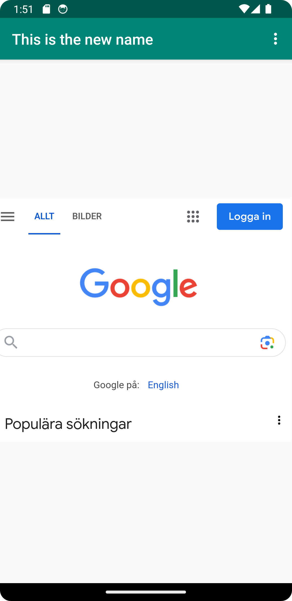
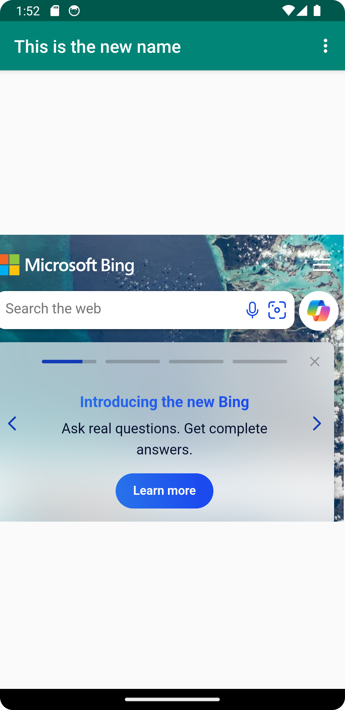

# Rapport

**Skriv din rapport här!**

_Du kan ta bort all text som finns sedan tidigare_.

## Följande grundsyn gäller dugga-svar:

- Ett kortfattat svar är att föredra. Svar som är längre än en sida text (skärmdumpar och programkod exkluderat) är onödigt långt.
- Svaret skall ha minst en snutt programkod.
- Svaret skall inkludera en kort övergripande förklarande text som redogör för vad respektive snutt programkod gör eller som svarar på annan teorifråga.
- Svaret skall ha minst en skärmdump. Skärmdumpar skall illustrera exekvering av relevant programkod. Eventuell text i skärmdumpar måste vara läsbar.
- I de fall detta efterfrågas, dela upp delar av ditt svar i för- och nackdelar. Dina för- respektive nackdelar skall vara i form av punktlistor med kortare stycken (3-4 meningar).

Programkod ska se ut som exemplet nedan. Koden måste vara korrekt indenterad då den blir lättare att läsa vilket gör det lättare att hitta syntaktiska fel.

Detta lades till i AndroidManifest.xml för att göra så appen kunde nå internet.
```
<uses-permission android:name="android.permission.INTERNET" />
<uses-permission android:name="android.permission.ACCESS_NETWORK_STATE" />
```

Jag skapade en WebView i activity_main.xml och gav den TheWebView som id.
```
<WebView
        android:id="@+id/TheWebView"
        android:layout_width="409dp"
        android:layout_height="326dp"
        android:layout_marginTop="160dp"
        android:layout_marginEnd="2dp"
        android:layout_marginRight="2dp"
        android:layout_marginBottom="190dp"
        app:layout_constraintBottom_toBottomOf="parent"
        app:layout_constraintEnd_toEndOf="parent"
        app:layout_constraintHorizontal_bias="1.0"
        app:layout_constraintStart_toStartOf="parent"
        app:layout_constraintTop_toBottomOf="@+id/appBarLayout"
        app:layout_constraintVertical_bias="1.0" />
```

I MainActivity.java skapades en WebView, WebViewClient och WebSettings.
```
private WebView myWebView;
private WebViewClient myWebViewCliente;
private WebSettings webSettings; 
```

I onCreate säts myWebView till WebViewn som hade skapats, myWebViewCliente sates som WebViewClient på myWebView 
och JavaScript activeras på myWebView. 
```
myWebView = findViewById(R.id.TheWebView);
myWebViewCliente = new WebViewClient();
myWebView.setWebViewClient(myWebViewCliente);

webSettings = myWebView.getSettings();
webSettings.setJavaScriptEnabled(true);
```

Till showExternalWebPage och showInternalWebPage lades det till vilka url som skule ladas när de aktiverades.
```
public void showExternalWebPage(){
        // TODO: Add your code for showing external web page here
        myWebView.loadUrl("https://www.google.com/");
}

public void showInternalWebPage(){
        // TODO: Add your code for showing internal web page here
        myWebView.loadUrl("https://www.bing.com/");
}
```

Tillsist så lades det till så att showExternalWebPage och showInternalWebPage kördes när korekt knap tryktes.
```
if (id == R.id.action_external_web) {
        Log.d("==>","Will display external web page");
        showExternalWebPage();
        return true;
}

if (id == R.id.action_internal_web) {
        Log.d("==>","Will display internal web page");
        showInternalWebPage();
        return true;
}
```
Bilderna av appen



